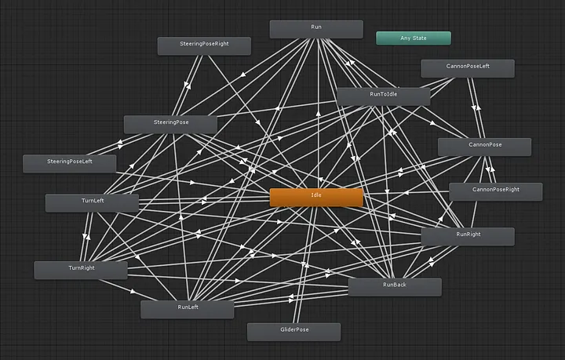

export const metadata = {
    title: 'How I invented The Act Pattern',
    description: "Taking you through the journey and thought process behind creating my custom design pattern.",
    thumbnail: "images/thumbnail.png",
    createdOnDate: new Date("2026-08-31"),
    searchKeywords: ["game-dev", "unity", "unreal", "godot"],
    isIndexed: true,
    isPublished: true
}
export const ACT_PATTERN_URL = "https://github.com/ManasMakde/act";
export const STATE_MACHINE_TUTORIAL_URL = "https://www.youtube.com/watch?v=-ZP2Xm-mY4E";
export const GODOT_TUTORIAL_URL = "https://www.youtube.com/watch?v=CLdJbAzaTpE&list=PL4cUxeGkcC9jTpR5D2z-xy7YRnWh9xnFM";
export const BEHAVIOUR_TREES_TUTORIAL_URL = "https://www.youtube.com/watch?v=6VBCXvfNlCM";
export const GOAP_TREE_TUTORIAL_URL = "https://www.youtube.com/watch?v=tdBWk2OVCWc";
export const MEDIATOR_PATTERN_URL = "https://refactoring.guru/design-patterns/mediator";
export const METROID_NES_URL = "https://en.wikipedia.org/wiki/Metroid_(video_game)";
export const THEATRICAL_ACTS_URL = "https://en.wikipedia.org/wiki/Act_(drama)"
export const MULTIPROCESSING_URL = "https://en.wikipedia.org/wiki/Multiprocessing"
export const KAHNS_ALGO_URL = "https://www.youtube.com/watch?v=cIBFEhD77b4"
export function OutLink({ url, children }) {
    return (<a href={url} target="_blank">{children}</a>)
}


## Index
1. [TL;DR](#tl-dr)
1. [What is the Act Pattern?](#what-is-the-act-pattern)
1. [Background](#background)
1. [Journey](#journey)
1. [The Over Shooting](#the-over-shooting)
1. [Conclusion](#conclusion)
<br/>


> ## TL;DR
> I created the <OutLink url={ACT_PATTERN_URL}>Act Pattern</OutLink> out of necessity while refusing to accept existing design patterns  
> and it was a journey through trials, errors & insanity.
> <br/>
> <details><summary>Why not State Machine?</summary></details> 
>
> <details><summary>Why not Behaviour Trees?</summary>_It's rigid & predictable and does not support parallelism._</details> 
>
> <details><summary>Why not GOAP?</summary>_It's far too complex and also does not support parallelism._</details> 

<br/>


## What is the Act Pattern?
It is a game design pattern that can manage complex behaviors with parallelism at its core.  
I'll let the code speak for itself:
```csharp
public class Player : MonoBehaviour
{
    MoveAct moveAct = new();
    LookAct aimAct = new();
    ShootAct shootAct = new();

    void Update()
    {
        // Move
        moveAct.direction = GetMoveDirection();
        moveAct.Perform();


        // Aim
        aimAct.targetPosition = GetMouseWorldPosition();
        aimAct.Perform();
        

        // Shoot
        if (Input.GetMouseButtonDown(0))
        {
            shootAct.direction = GetShootDirection();
            shootAct.Perform();
        }
    }
}

// Works with Unreal & Godot as well
```

Visit the <OutLink url={ACT_PATTERN_URL}>repository</OutLink> for a guide on how to use & technical breakdown of how it works.
<br/>


## Background
Picture this, you're 17 again, just started to get into game dev. You've installed a game engine,
looked up some tutorials, maybe downloaded a few assets and are ready to make your first game.

You code your very first controllable character. No structure. No architecture. Just raw "_yep looks good_" code. 

<Pic src="images/character-example-1.gif" href={GODOT_TUTORIAL_URL} target="__blank" subtext="Credit: Net Ninja" alt="Character Example 1" style="max-width: 500px;" />

Nothing fancy, just a little platformer character with arrow keys to move and spacebar to shoot
but you have fun playing around with your first character. 

After a while your level starts to look a bit empty so you whip up an enemy for your character to shoot at.

<Pic src="images/character-example-2.gif" alt="Character Example 2" style="max-width: 500px;" />

Doesn't do much only walks around left to right but a solid start none the less.  
You play around some more and already start seeing your game come to life.

Now feeling more confident, you add more features to the enemy AI like following the player around, shooting, patrolling, etc
but you quickly realize your unstructured code is not maintainable.

You do a quick online search and come across <OutLink url={STATE_MACHINE_TUTORIAL_URL}>State Machine</OutLink>. It looks solid. 
Makes sense, so you rewrite your enemy AI code into states.

```js
const State = { 
    PATROL: 0, 
    CHASE: 1, 
    ATTACK: 2, 
    HURT: 3 
}
let currentState = State.PATROL

function updateState(enemy, player) {
    if (enemy.gotHit) {
        currentState = State.HURT
        return
    }


    if (currentState === State.PATROL) {
        if (canSeePlayer(enemy, player)) {
            currentState = State.CHASE
        }
    }
    else if (currentState === State.CHASE) {
        if (!canSeePlayer(enemy, player)) {
            currentState = State.PATROL
        }
        else if (inAttackRange(enemy, player)) {
            currentState = State.ATTACK
        }
    }
    else if (currentState === State.ATTACK) {
        if (!inAttackRange(enemy, player)) {
            currentState = State.CHASE
        }
    }
    else if (currentState === State.HURT) {
        if (enemy.hurtTimer <= 0) {
            currentState = State.PATROL
        }
    }
    else {
        currentState = State.PATROL
    }
}
```

You continue adding more and more features but eventually hit a roadblock with one conclusion:  
_**states are manageable but the transitions are not**_  
i.e. anytime you have more than 3 or 4 states it becomes a pain in the ass to maintain/figure out all the transitions and 
may god have mercy on your soul if you try to add a 5th state.  
<br/>

Looking for a better way you go back online searching and find <OutLink url={BEHAVIOUR_TREES_TUTORIAL_URL}>Behaviour Trees</OutLink>. 
This one looks promising. It has the same so-called _states_ but as _leaf nodes_ 
and the so-called _transitions_ here are in the form of traversing down a tree and hence everything seems self-contained.

```js
const enemyTree = Selector([
    Sequence([
        Condition(enemy => enemy.health <= 0),
        Action(playDeathAnim)
    ]),
    Sequence([
        Condition(enemy => enemy.gotHit),
        Action(playHurtAnim)
    ]),
    Sequence([
        Condition((enemy, player) => inAttackRange(enemy, player)),
        Action(attackPlayer)
    ]),
    Sequence([
        Condition((enemy, player) => canSeePlayer(enemy, player)),
        Action(chasePlayer)
    ]),
    Action(patrol)
])

function tick(enemy, player) {
    enemyTree.run(enemy, player)
}
```

So you get to work rewriting your code again into nodes of a behaviour tree. You spend days creating your first few levels and then you finally play it.
The first time you play the game it feels great but as you keep playing it over and over again, it starts to feel monotonous. The enemies start to feel predictable & fixed
and you just know someone online will whine about it.

<Pic src="images/rogue-like-meme.webp" alt="Rogue like meme" style="max-width: 300px;" />

You search again online and this time find <OutLink url={GOAP_TREE_TUTORIAL_URL}>Goal Oriented Action Planning (GOAP)</OutLink>. 
The A* algorithm, heuristics, effects, conditions, etc feel a bit overkill but alright, you go along with it. Rewriting your code yet again you finally have a fun replayable level.

Now the only thing remaining in your game is a good boss fight. While designing your boss you realize that the boss is not like other common enemies. 
A good boss AI doesn't just do 1 thing at a time, instead it does several things in parallel e.g. throwing bombs + shooting + dashing and bouncing all across the level map.

<Pic src="images/boss-example.gif" subtext="Credit: The Messenger - Arcane Golem" alt="Boss Example" />

You go back online thinking surely someone must have come up with an elegant solution for this. You search and search but nope nothing shows up
and you eventually accept that these are your only options while making a game.

Everyone in game dev (including me) has experienced the same thing upto this point. But beyond this point is where my story deviates from other devs because
I _refused_ to accept that there is no other way to make games.
<br/>


## Journey
I started off by wanting to make a design pattern which was intuitive, convenient and code friendly i.e. didn't require a whole separate UI to operate.

I initially tried coming up with several different approaches at the same time which quickly devolved into pure madness.
In hindsight I was diving headfirst into the problem without actually clarifying what the problem _was_.

<Pic src="images/dive.gif" subtext="Credit: Tom & Jerry - Cruise Cat" alt="Dive meme" style="max-width: 400px;" />


So I took a step back and compressed the problem down to one line:  
**How do I manage multiple character behaviours?**

The first thing I did was search up online if any other programming field other than game dev had come up with a solution I could port over, which is where I came across the <OutLink url={MEDIATOR_PATTERN_URL}>mediator pattern</OutLink>.
It seemed simple enough so I came up with this:

<Pic src="images/board-1.png" alt="Board 1" />

Basically you would have certain self contained `actions` like jump, run, walk, idle, etc and each `action` would have certain condition `flags` associated with it.
A `mediator` would iterate all actions from left to right and whosever `flags` were true was the current action.

But I realized there were certain actions that would stop the entire iteration like damage or death so I added `blocking actions`
i.e. actions that would interrupt & block the `mediator` from iterating if their flags were true.

<Pic src="images/board-2.png" alt="Board 2" />

It felt like an elegant solution at the time so I rolled with it. 
I started using it to make a game and soon enough a simple fact dawned on me: _no character actually ever does **just** one thing at a time_.
Think about it, even in some of the oldest games like <OutLink url={METROID_NES_URL}>Metroid (NES)</OutLink> 
you could walk and shoot around at the same time.

<Pic src="images/metroid.gif" subtext="Credit: Metroid (NES)" alt="Metroid Example" style="max-width: 450px;" />

Immediately I realized the question was incomplete and instead it should have been:  
**How do I manage multiple character behaviours _in parallel?_**

Those 2 additional words changed my entire perspective. I dived back into the madness for months and eventually took inspiration from nature itself 
while also salvaging what other game design patterns did right:

1. **State Machine**: "Entering" & "Exiting" from a state felt intuitive.
1. **Behaviour Tree**: The condition node & sequence node were easy to use.
1. **GOAP**: The principle that some actions need to come before others also felt right.

I tossed in a little blocking system of my own in there & renamed `actions` to `acts`
and _badabing badaboom_ the first prototype was ready:

<Pic src="images/board-3.png" alt="Board 3" />

> Also, can we take a moment to appreciate the naming convention?  
> Since I took <OutLink url={THEATRICAL_ACTS_URL}>theatrical acts</OutLink> as reference the terminology came along so intuitively:  
> _"Performing an act..."_, _"Prologue acts..."_, etc.

Now I could have just stopped here and it would have been almost done but nOoOoO I _had_ to overdo it 🙄.  
<br/>


## The Over Shooting
I will admit I got carried away trying to solve the problem and went too deep down the rabbit hole and tried to solve for **true parallelism**.
What do I mean by that? Usually in video games most of the code does not actually run in parallel and therefore everything has a fixed deterministic order. 
In true parallelism there is no guarantee of order like in <OutLink url={MULTIPROCESSING_URL}>multiprocessing</OutLink>.

I wanted to incorporate the "non fixed order" into the blocking mechanism.
Since it's impossible by default, I gave each act a block priority, treated acts as vertices & blocks as edges in a directed acyclic graph
and accidentally ended up reinventing <OutLink url={KAHNS_ALGO_URL}>Kahn's algorithm</OutLink> (was going to call it Makde's algorithm but he beat me to it by ~64 years lmao).

But inevitably the complexity of the code got to me and common sense caught up, 
so I revert back and did plenty of modifications & testing, eventually making it what it is today.
<br/>


## Conclusion
I feel like all of the other design patterns had parts of the right answer and were just waiting to be unified.
Also, when pointed out it's so obvious that everything naturally works in parallel but at the same time a very difficult conclusion to reach on your own.

And I'll be honest with you I have no idea what to categorize this as. Is it a design pattern? A programming pattern? A framework? An architecture? 
Idk but I settled for design pattern for now. Let me know if there's a better way to classify it since I'm still a novice at semantics.

So far I've been having a blast using the act pattern in pretty much everything and it really makes making games _actually_ fun and intuitive again. 
However it is still in alpha version and remains to be seen if it will stand the test of time or if it was just a clever workaround.

Feel free to play around with it and let me know your thoughts on it. I'll also try periodically updating this article to keep everyone updated on how it's going but fingers crossed for now 🤞.
