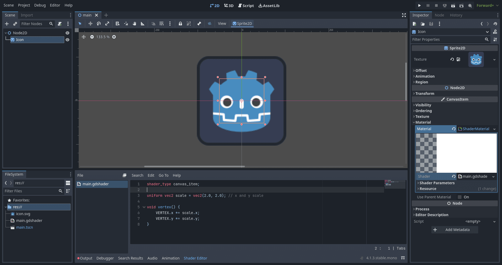

export const metadata = {
    title: 'Scale via shader in godot',
    thumbnail: "scale-godot-shader.webp",
    createdOnDate: new Date("2023-11-26"),
    tags: ["godot", "shader", "godot-shader-language"]
}


```gdscript
shader_type canvas_item;

uniform vec2 scale = vec2(2.0, 2.0); // x and y scale

void vertex() {
    VERTEX.x *= scale.x;
    VERTEX.y *= scale.y;
}
```

Editor screenshot for reference:


